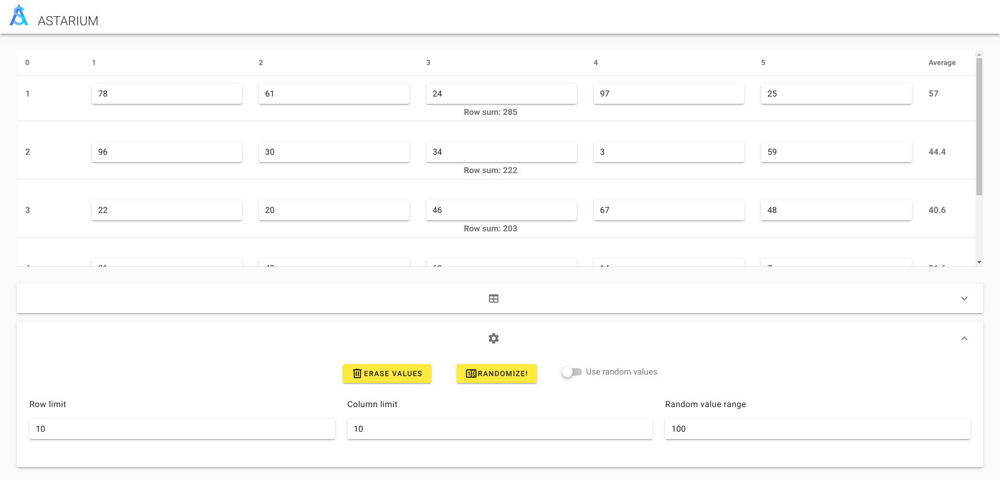

# Astarium

A Vue.js project - expansible table.

## Demo



## Pre Setup

You should have installed [node.js](https://nodejs.org/en/)
In this project the [yarn](https://yarnpkg.com/en/) package manager is used, but you can use [npm](https://www.npmjs.com/get-npm) package manager instead.

## Project setup

1. Clone git repository: `git clone https://github.com/JustCaptcha/create-react-cv.git`
2. Install all dependencies: `npm install` or `yarn install`

### Compiles and hot-reloads for development

```sh
yarn serve
```

### Compiles and minifies for production

```sh
yarn build
```

### Run unit tests

```sh
yarn test:unit
```

```sh
yarn lint
```

### Customize configuration

See [Configuration Reference](https://cli.vuejs.org/config/).
